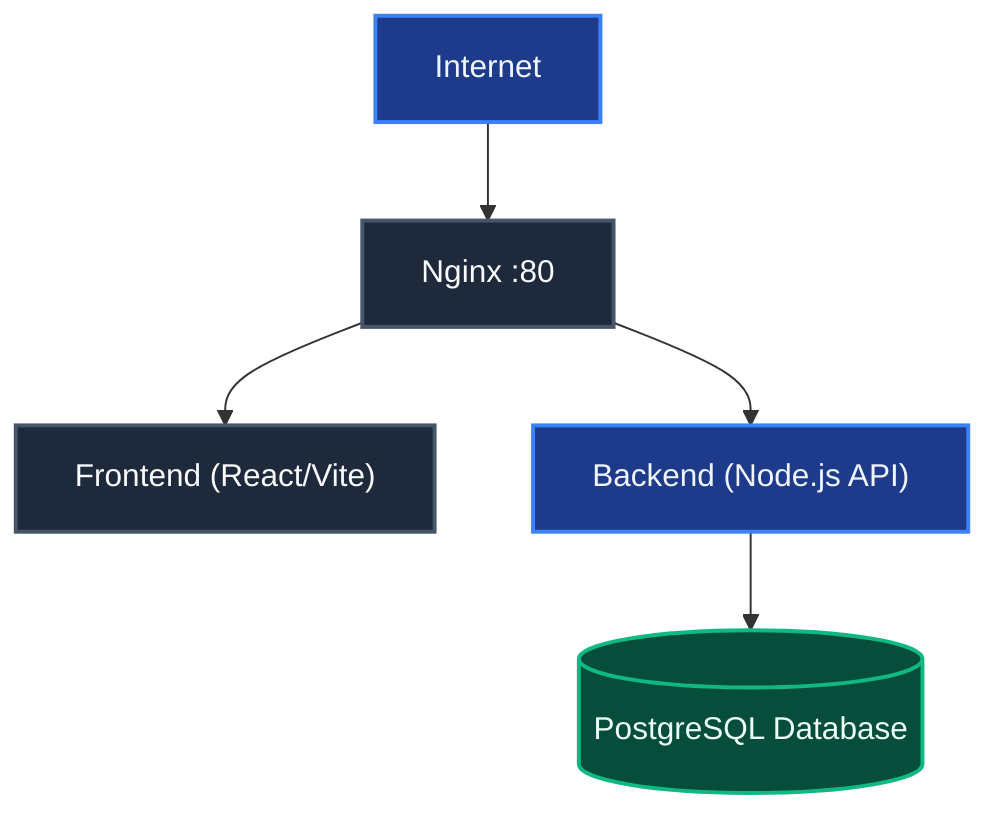
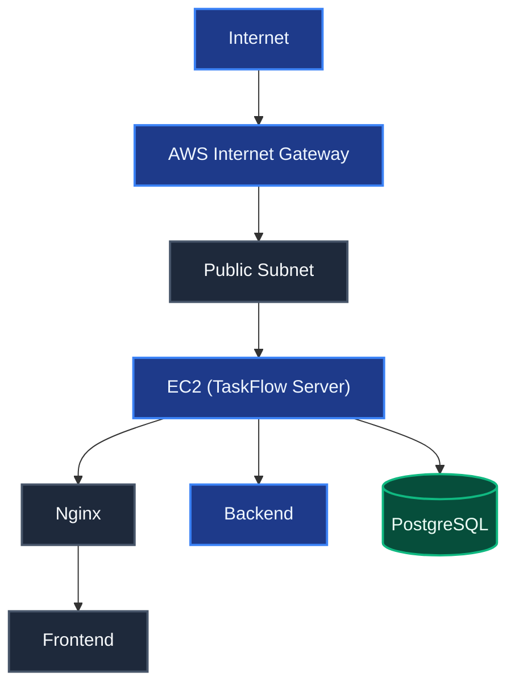
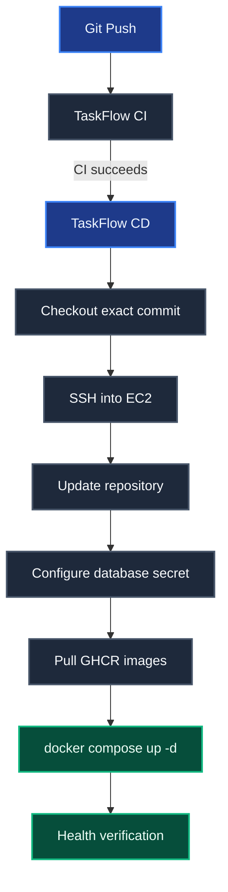
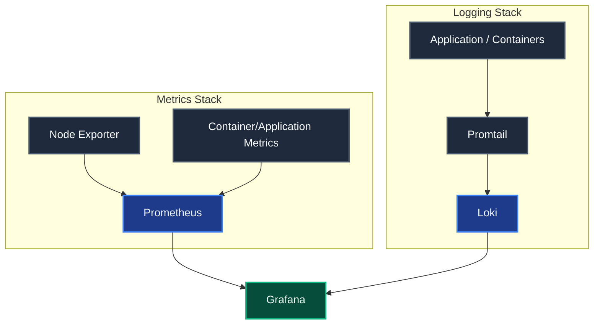
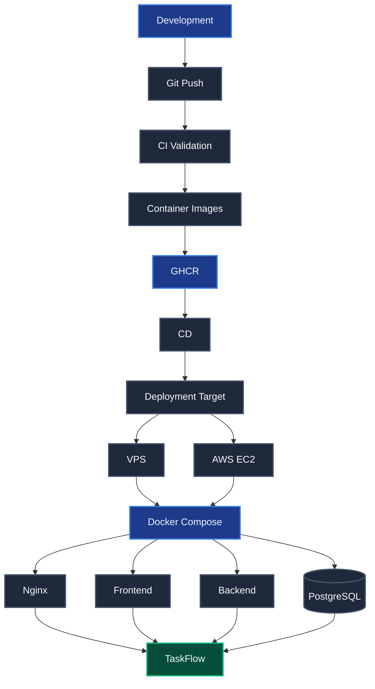

# TaskFlow

TaskFlow is a production-oriented full-stack task management application deployed with Docker Compose. The project supports local development, generic Ubuntu VPS deployment, and AWS deployment using Terraform and GitHub Actions.

## Table of Contents

- [Architecture](#architecture)
- [Prerequisites](#prerequisites)
- [Repository Structure](#repository-structure)
- [Configuration and Secrets](#configuration-and-secrets)
- [Local Deployment](#local-deployment)
- [VPS Deployment](#vps-deployment)
- [AWS Deployment](#aws-deployment)
- [GitHub Actions CI/CD](#github-actions-cicd)
- [Verification](#verification)
- [Troubleshooting](#troubleshooting)
- [Security Considerations](#security-considerations)
- [Future Improvements](#future-improvements)
- [Operational Lifecycle](#operational-lifecycle)

---

## Architecture

The application consists of four primary services:



Docker Compose provides the service network and persistent PostgreSQL storage.

### Services

| Service | Purpose | Internal Port |
| :--- | :--- | :--- |
| `postgres` | PostgreSQL database | 5432 |
| `backend` | Node.js/Express API | 9001 |
| `frontend` | React/Vite frontend served by Nginx | 80 |
| `nginx` | Reverse proxy and public gateway | 80 |

The public entry point is Nginx. The backend and PostgreSQL services do not need to be directly exposed to the Internet.

---

## Prerequisites

### Local Development

**Required:**
- Git
- Docker Engine or Docker Desktop
- Docker Compose
- Internet access for pulling images and dependencies

**Verify:**
```bash
git --version
docker --version
docker compose version
```

### Ubuntu VPS

**Required:**
- Ubuntu VPS
- SSH access
- Sudo privileges
- Public IP address
- Git
- Docker Engine
- Docker Compose plugin
- Ports 22 and 80 allowed by the VPS firewall/security group

**Verify:**
```bash
git --version
docker --version
docker compose version
```

### AWS Deployment

**Required:**
- AWS account
- AWS CLI configured if managing AWS resources manually
- Terraform
- Git
- SSH key pair
- GitHub repository
- GitHub Actions enabled
- GitHub Container Registry access for deployment images

**Verify:**
```bash
terraform --version
git --version
ssh -V
```

---

## Repository Structure

The project structure is organized as follows:

```
taskflow/
├── backend/
├── frontend/
├── database/
├── nginx/
├── infrastructure/
│   ├── main.tf
│   ├── variables.tf
│   ├── outputs.tf
│   └── modules/
│       ├── vpc/
│       ├── security_groups/
│       └── ec2/
├── scripts/
│   ├── setup.sh
│   ├── deploy.sh
│   └── health-check.sh
├── secrets/
├── docker-compose.yml
├── .env.example
└── .gitignore
```

For direct navigation, you can access individual project files and directories here:
- [`backend/`](file:///home/devopsuser/taskflow/backend)
- [`frontend/`](file:///home/devopsuser/taskflow/frontend)
- [`database/`](file:///home/devopsuser/taskflow/database)
- [`nginx/`](file:///home/devopsuser/taskflow/nginx)
- [`infrastructure/`](file:///home/devopsuser/taskflow/infrastructure)
  - [`main.tf`](file:///home/devopsuser/taskflow/infrastructure/main.tf)
  - [`variables.tf`](file:///home/devopsuser/taskflow/infrastructure/variables.tf)
  - [`outputs.tf`](file:///home/devopsuser/taskflow/infrastructure/outputs.tf)
  - [`modules/vpc/`](file:///home/devopsuser/taskflow/infrastructure/modules/vpc)
  - [`modules/security_groups/`](file:///home/devopsuser/taskflow/infrastructure/modules/security_groups)
  - [`modules/ec2/`](file:///home/devopsuser/taskflow/infrastructure/modules/ec2)
- [`scripts/`](file:///home/devopsuser/taskflow/scripts)
  - [`setup.sh`](file:///home/devopsuser/taskflow/scripts/setup.sh)
  - [`deploy.sh`](file:///home/devopsuser/taskflow/scripts/deploy.sh)
  - [`health-check.sh`](file:///home/devopsuser/taskflow/scripts/health-check.sh)
- [`secrets/`](file:///home/devopsuser/taskflow/secrets)
- [`docker-compose.yml`](file:///home/devopsuser/taskflow/docker-compose.yml)
- [`.env.example`](file:///home/devopsuser/taskflow/.env.example)
- [`.gitignore`](file:///home/devopsuser/taskflow/.gitignore)

The [`infrastructure/`](file:///home/devopsuser/taskflow/infrastructure) directory contains AWS-specific Terraform configuration. The application itself is containerized and can run independently of AWS.

---

## Configuration and Secrets

The repository must not contain production secrets. 

The following files must remain uncommitted:
- `.env` (managed locally or on the server)
- `secrets/` (directory containing operational secrets)
- `*.pem` (private keys)
- `*.key` (SSL/TLS private keys)

The project uses [`.env`](file:///home/devopsuser/taskflow/.env) for non-secret configuration and [`secrets/db_password`](file:///home/devopsuser/taskflow/secrets/db_password) for the PostgreSQL password.

### Example Environment Configuration

Create a local or VPS [`.env`](file:///home/devopsuser/taskflow/.env) file from [`.env.example`](file:///home/devopsuser/taskflow/.env.example):
```bash
cp .env.example .env
```

Example configuration values:
```ini
POSTGRES_DB=taskflow
POSTGRES_USER=taskflow_user

PORT=9001
NODE_ENV=production

DATABASE_HOST=postgres
DATABASE_PORT=5432
DATABASE_NAME=taskflow
DATABASE_USER=taskflow_user

CORS_ORIGIN=http://localhost
VITE_API_URL=/api
```

> [!IMPORTANT]
> The database hostname `DATABASE_HOST` is set to `postgres`. This refers to the Docker Compose service name, not the VPS or EC2 public IP.

### Database Password

Create the Docker secret file:
```bash
mkdir -p secrets
echo 'YOUR_STRONG_DATABASE_PASSWORD' > secrets/db_password
chmod 600 secrets/db_password
```

Do not add the password file to Git.

---

## Local Deployment

Local deployment is useful for development, testing, and validating Docker Compose configuration before deploying to infrastructure.

1. Clone the repository:
   ```bash
   git clone https://github.com/hridyen/taskflow-production-ready-devops-project.git
   cd taskflow-production-ready-devops-project
   ```

2. Create environment configuration:
   ```bash
   cp .env.example .env
   ```
   Edit the file to set the required values. For local Compose networking, verify the following are set:
   ```ini
   DATABASE_HOST=postgres
   DATABASE_PORT=5432
   DATABASE_NAME=taskflow
   DATABASE_USER=taskflow_user
   ```

3. Create the database secret:
   ```bash
   mkdir -p secrets
   echo 'YOUR_DATABASE_PASSWORD' > secrets/db_password
   chmod 600 secrets/db_password
   ```

4. Validate the Docker Compose configuration:
   ```bash
   docker compose config
   ```
   Ensure there are no warnings or missing required environment variables.

5. Build and start the services:
   - For a source-based deployment:
     ```bash
     docker compose build
     docker compose up -d
     ```
   - If the Compose file references pre-built registry images:
     ```bash
     docker compose pull
     docker compose up -d
     ```

6. Verify the running containers:
   ```bash
   docker compose ps
   ```
   View service logs:
   - All logs: `docker compose logs --tail=100`
   - Backend logs: `docker compose logs backend --tail=100`
   - PostgreSQL logs: `docker compose logs postgres --tail=100`

7. Test the application endpoints:
   - Database health check:
     ```bash
     curl -i http://localhost/api/db-health
     ```
   - Tasks API endpoint:
     ```bash
     curl -i http://localhost/api/tasks
     ```
   Expected response:
   ```http
   HTTP/1.1 200 OK
   ```
   The frontend is accessible at `http://localhost`.

---

## VPS Deployment

The VPS deployment is provider-independent. The same application can run on a compatible Ubuntu VPS from any cloud provider.

1. Connect to the VPS via SSH:
   ```bash
   ssh ubuntu@YOUR_VPS_IP
   ```
   *Note: The SSH username may differ depending on the VPS provider.*

2. Clone the repository:
   ```bash
   git clone https://github.com/hridyen/taskflow-production-ready-devops-project.git
   cd taskflow-production-ready-devops-project
   ```

3. Run the setup script to install system packages, Docker, and configure permissions:
   ```bash
   ./scripts/setup.sh
   ```

4. Log out of the SSH session and log back in to apply Docker group permission changes:
   ```bash
   exit
   ssh ubuntu@YOUR_VPS_IP
   cd taskflow-production-ready-devops-project
   ```

5. Configure the environment variables:
   ```bash
   cp .env.example .env
   nano .env
   ```
   Ensure Docker Compose internal hostname defaults are configured:
   ```ini
   DATABASE_HOST=postgres
   DATABASE_PORT=5432
   DATABASE_NAME=taskflow
   DATABASE_USER=taskflow_user
   ```
   Configure the production `CORS_ORIGIN` according to the domain being used.

6. Configure the database secret:
   ```bash
   mkdir -p secrets
   echo 'YOUR_STRONG_DATABASE_PASSWORD' > secrets/db_password
   chmod 600 secrets/db_password
   ```

7. Run the deployment script to build images and start services:
   ```bash
   ./scripts/deploy.sh
   ```

8. Verify the installation:
   ```bash
   docker compose ps
   ./scripts/health-check.sh
   ```
   Access the application using `http://YOUR_VPS_PUBLIC_IP`.
   
   For production HTTPS, point a domain to the VPS and configure TLS termination in the reverse proxy.

---

## AWS Deployment

AWS deployment uses Terraform to provision infrastructure and GitHub Actions for continuous deployment.

### AWS Architecture



Terraform provisions:
- Virtual Private Cloud (VPC)
- Public Subnet
- Internet Gateway
- Route Tables
- Security Groups
- EC2 Instance
- EC2 SSH Key Pair

The EC2 bootstrap process installs Docker, Docker Compose, Git, and configures the environment.

1. **Configure SSH Key**
   Generate a key pair for CD deployment if required:
   ```bash
   ssh-keygen -t ed25519 -f ~/.ssh/taskflow_cd
   ```
   The public key is supplied to Terraform, while the private key must never be committed to Git.

2. **Configure Terraform Variables**
   Change to the infrastructure directory:
   ```bash
   cd infrastructure
   ```
   Create a variables file:
   ```bash
   nano terraform.tfvars
   ```
   Example configuration:
   ```hcl
   project_name       = "taskflow"
   environment        = "production"
   instance_type      = "t3.micro"
   ssh_public_key     = "YOUR_PUBLIC_KEY"
   ```
   Refer to [`variables.tf`](file:///home/devopsuser/taskflow/infrastructure/variables.tf) for the authoritative list of variables.

3. **Initialize Terraform**
   ```bash
   terraform init
   ```

4. **Format and Validate**
   ```bash
   terraform fmt -recursive
   terraform validate
   ```

5. **Review the Plan**
   ```bash
   terraform plan
   ```
   Always review the plan before applying changes.

6. **Provision AWS Infrastructure**
   ```bash
   terraform apply
   ```
   Confirm by typing `yes`. Terraform outputs the EC2 public IP. You can query it later with:
   ```bash
   terraform output ec2_public_ip
   ```

7. **Verify EC2 Bootstrap**
   SSH into the new instance:
   ```bash
   ssh -i ~/.ssh/taskflow_cd ubuntu@YOUR_EC2_PUBLIC_IP
   ```
   Verify services on the host:
   ```bash
   docker --version
   docker compose version
   cat ~/taskflow-production-ready-devops-project/.env
   ```
   The bootstrap script initializes the non-secret environment. Database secrets remain as Docker secrets.
   
   Verify the `cloud-init` execution status:
   ```bash
   sudo cloud-init status --long
   ```
   If troubleshooting is required, inspect the bootstrap logs:
   ```bash
   sudo tail -100 /var/log/cloud-init-output.log
   ```

---

## GitHub Actions CI/CD

The CD workflow requires the minimum deployment secrets necessary to connect to the server and configure the database.

### 1. Configure GitHub Actions Secrets

Add the following secrets under your GitHub repository settings:
- `DEPLOY_HOST`: The current EC2 public IP or configured deployment hostname.
- `DEPLOY_USER`: `ubuntu` (for the standard Ubuntu AMI).
- `DEPLOY_SSH_KEY`: The private SSH key matching the public key registered with Terraform.
- `DB_PASSWORD`: The PostgreSQL password used by the Docker secret.

Do not commit any of these secrets to the repository.

### 2. GitHub Actions Flow

The deployment workflow is designed to follow this pipeline:



The deployment configuration preserves local configuration details (like `.env`) created during infrastructure provisioning rather than deleting them during repository updates.

### 3. Verify AWS Deployment

Log in to the EC2 instance and run the following checks:
```bash
cd ~/taskflow-production-ready-devops-project
docker compose ps
docker compose logs backend --tail=100
docker compose logs postgres --tail=100
curl -i http://localhost/api/db-health
curl -i http://localhost/api/tasks
```
Expected output:
```http
HTTP/1.1 200 OK
```
The application should then be reachable at `http://YOUR_EC2_PUBLIC_IP`.

---

## Verification

### Deployment Comparison

| Area | Local | VPS | AWS |
| :--- | :--- | :--- | :--- |
| **Infrastructure** | Existing machine | Manually provisioned | Terraform |
| **OS Setup** | Existing | Manual | `cloud-init` |
| **Docker** | Local installation | Manual | Terraform bootstrap |
| **Application** | Docker Compose | Docker Compose | Docker Compose |
| **Database** | PostgreSQL container | PostgreSQL container | PostgreSQL container |
| **Reverse Proxy** | Nginx | Nginx | Nginx |
| **Configuration** | [`.env`](file:///home/devopsuser/taskflow/.env) | [`.env`](file:///home/devopsuser/taskflow/.env) | Terraform-created `.env` |
| **Secrets** | Docker secret | Docker secret | GitHub Actions + Docker secret |
| **Deployment** | Manual | Manual | GitHub Actions CD |
| **Container Registry** | Optional | Optional | GHCR |
| **Infrastructure Automation** | No | Optional | Terraform |

### Verification Checklist

After deployment, verify the following checklist:

#### Infrastructure
- [ ] Running `terraform validate` succeeds.
- [ ] Running `terraform plan` outputs expected resource changes.
- [ ] For AWS: `terraform output` returns valid variables.

#### Docker
- [ ] `docker --version` returns version details.
- [ ] `docker compose version` returns version details.

#### Containers
- [ ] Running `docker compose ps` shows the following expected services:
  - `taskflow-postgres`
  - `taskflow-backend`
  - `taskflow-frontend`
  - `taskflow-nginx`

#### Database & API
- [ ] Running [`./scripts/health-check.sh`](file:///home/devopsuser/taskflow/scripts/health-check.sh) reports `TaskFlow is HEALTHY`.
- [ ] `curl -i http://localhost/api/db-health` returns `200 OK`.
- [ ] `curl -i http://localhost/api/tasks` returns `200 OK`.

#### Frontend
- [ ] Opening `http://SERVER_IP` (or the configured production domain) loads the TaskFlow client.

---

## Troubleshooting

### Docker Permission Denied

If you encounter:
```
permission denied while trying to connect to the Docker daemon
```
Run the following commands:
```bash
sudo usermod -aG docker $USER
```
Log out and reconnect, then run:
```bash
docker ps
```

### Docker Compose Reports Missing Environment Variables

Check if the environment file exists and contains entries:
```bash
ls -la .env
cat .env
docker compose config
```
Verify that the required variables match your expected configuration.

### Backend Cannot Connect to PostgreSQL

1. Check container health status:
   ```bash
   docker compose ps
   ```
2. View service logs:
   ```bash
   docker compose logs backend --tail=100
   docker compose logs postgres --tail=100
   ```
3. Check env configuration inside the container:
   ```bash
   docker exec taskflow-backend env | grep '^DATABASE_'
   ```
   Ensure `DATABASE_HOST` is set to `postgres`. The database hostname inside Docker Compose must be the Postgres container service name, not the public VPS or EC2 IP.

### PostgreSQL User Does Not Exist

If the database was initialized with incorrect credentials, PostgreSQL may have already created its data directory using the incorrect user.

For a disposable development/test environment, reset the data volume and re-initialize:
```bash
docker compose down -v
docker compose up -d
```
> [!CAUTION]
> Do not use the `-v` flag on a production database containing active data unless data destruction is explicitly intended.

### Backend Health Check Fails

Inspect backend logs and query the endpoint directly:
```bash
docker compose logs backend --tail=100
curl -i http://localhost/api/db-health
```
Verify database container status:
```bash
docker compose logs postgres --tail=100
```

### Cloud-Init Bootstrap Failure on AWS

1. Check the general bootstrap status:
   ```bash
   sudo cloud-init status --long
   ```
2. Inspect the output log file:
   ```bash
   sudo tail -150 /var/log/cloud-init-output.log
   ```
3. Inspect the shebang of the generated script:
   ```bash
   sudo head -20 /var/lib/cloud/instance/scripts/part-001 | cat -A
   ```
   The script must begin with `#!/bin/bash` with no whitespace or characters preceding the shebang.

---

## Security Considerations

- Never commit [`.env`](file:///home/devopsuser/taskflow/.env) files containing production credentials.
- Never commit private SSH keys.
- Keep the [`secrets/`](file:///home/devopsuser/taskflow/secrets) directory out of version control.
- Use strong database passwords.
- Expose only the required public ports (e.g., port 80/443).
- Do not expose PostgreSQL directly to the Internet; keep backend and database ports internal to the Docker network where possible.
- Use HTTPS for production domains.
- Use least-privilege AWS IAM permissions.
- Review Terraform plans before applying infrastructure changes.
- Keep the Terraform state file protected as it can contain sensitive information.
- Set up persistent storage and automated backups before treating the PostgreSQL container as production data storage.

---

## Future Improvements

The current deployment establishes the infrastructure, containerization, and CI/CD foundation. The following improvements are planned:

### Production Observability



Planned capabilities include:
- EC2 resource monitoring
- Container metrics
- Application metrics
- CPU and memory monitoring
- Disk monitoring
- Centralized logs
- Grafana dashboards
- Alerting
- Service health monitoring

### Additional Infrastructure Improvements

Future AWS improvements may include:
- Application Load Balancer
- Private subnets
- NAT Gateway
- RDS PostgreSQL
- IAM roles instead of long-lived credentials
- Auto Scaling
- Route 53
- ACM TLS certificates
- S3 integration
- CloudWatch integration
- Backup and disaster recovery
- Infrastructure state stored in a remote Terraform backend

These improvements will be introduced incrementally without duplicating concepts already implemented in the current architecture.

---

## Operational Lifecycle

The operational lifecycle of the project is defined as follows:



The same containerized application can therefore be deployed locally, on a generic VPS, or on AWS while keeping the application architecture consistent.
